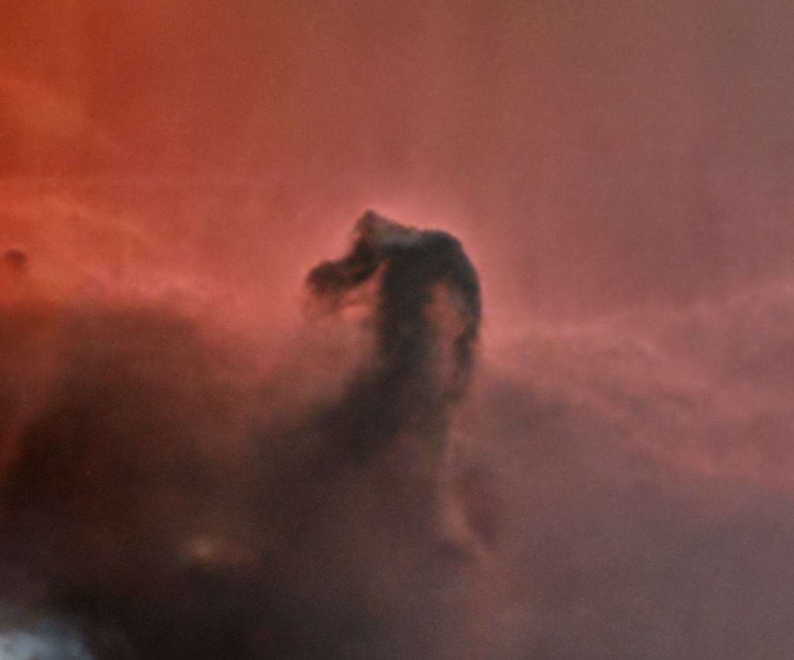

# FITS Viewer

A fast and interactive FITS file viewer for quickly inspecting and sorting astrophotography image sequences.



## Features

- Displays FITS images in full resolution with fast histogram normalization
- Keyboard controls:
  - ➡️ Arrow Right: Next image
  - ⬅️ Arrow Left: Previous image
  - ❌ `d`: Delete current image
  - 🛑 `q`: Quit the viewer
- Displays images in fullscreen with black background
- Image data remains unchanged (no modification or rescaling)

## Requirements

- Python 3.10 or newer
- Required Python packages:
  - `astropy`
  - `matplotlib`
  - `numpy`

## Installation

Install required packages via pip:

```bash
pip install astropy matplotlib numpy
```

## Usage

1. Open `FITS_Viewer_V1.0.py` in a code editor.
2. Adjust the path to your FITS image folder inside the script.
3. Run the script using:

```bash
python FITS_Viewer_V1.0.py
```

## License

This project is licensed under the MIT License – see the `LICENSE` file.
